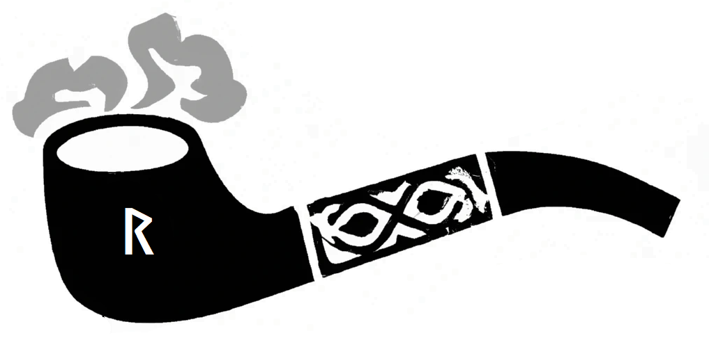

# rune-pipe
A python project to clean up [RUNDATA](https://www.nordiska.uu.se/forskn/samnord.htm)

According to the rundata documentation, 

|File Name|Description|
|---------|---------------------------------------|
|FVN      |Old west norse                         |
|FVNX     |Old west norse in a searchable format  |
|FORNSPR  |Ancient language                       |
|FORNSPRX |Ancient language in a searchable format|
|RUNTEXT  |Transliterated rune text               |
|RUNTEXTX |Runtext in a searchable format         |